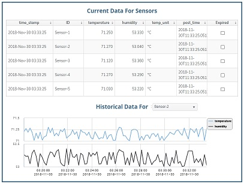

# RTView-Flogo  - RTView Integration with Project Flogo

## Overview

Project Flogo provides powerful tools to build microservices with an ultralight framework that takes advantage of new IoT, edge, and serverless application architectures. With TIBCO's Flogo® Enterprise, data can be collected or analyzed locally on the smallest of IoT devices, so decisions and actions can be made in real time.

RTView is a real-time data management, visualization and analytics engine provided by SL Corporation (www.sl.com). It is used by organizations worldwide as a key component of mission-critical monitoring and control systems, built around various middleware, infrastructure, telemetry and IoT data sources.

This `RTView-Flogo` repository provides instructions and examples showing how to push real-time monitoring data from a Flogo application into an instance of an RTView DataServer and how to use RTView Cloud to create custom dashboards to display the data in real-time. The data shown can be built-in data collected about Flogo Events, Instances, and Tasks. Additionally, the user may define data tables that are specific to the application being monitored.Within RTView, the collected data may then be correlated and integrated with data from many other sources supported by RTView, including most TIBCO messaging and integration products.

One of the sample displays created in this example is shown below:



By following the steps described below you will:

* Create an account on RTView Cloud
* Download and run an RTView DataServer on your local computer or in a cloud service
* Run a Node.js program that defines a few data structures within the RTView DataServer
* Configure and Run the Flogo sample application, instrumented with RTView
* Import a sample display into RTView Cloud, showing real-time data coming from the Flogo program

## Create an RTView Cloud account
An RTView Cloud account provides the tools for creating, viewing and publishing rich graphical displays connected to real-time data sources.

* In a browser, go to [RTView Cloud](http://rtviewcloud.sl.com/).
* Click on Start Free Trial to create your account (skip if you have an account already).
* Login to your RTView Cloud account.

Note that you are automatically placed into your own private organization (e.g. JohnSPrivateOrg).
	
## Download and run the RTView DataServer	

The RTView DataServer is the data management component that provides in-memory caching and optional archival to persistent storage. Data stored there may be consumed by displays, dashboards, reports and alerts provided by a visualization and analytics tool such as RTView Cloud. You can download and launch the RTView DataServer in your own environment, or you can elect a single-click deployment in one of several common Cloud Platforms.

If you would like to run the RTView DataServer in your own environment, follow the instructons below. 
```
Note: You will need Java version 1.8 or higher to run this locally
```
* From your RTView Cloud account, click on the ? icon at upper right to go to the Support page.
* Select Downloads and elect to download the RTView DataServer to your computer.
* Unzip the downloaded **RTViewDataServer_?.?.?.?.zip** file to a directory of your choice.
* Open a Command Window or Linux Shell in that directory.

To start the RTView DataServer:
```
cd RTViewDataServer

start_server          (or ./start_server.sh in Linux)
```
The RTView DataServer is now ready to receive data at the following http URL:
```
http(s)://localhost:3270/rtvpost
```
At any time you can stop the server:
```
stop_server           (or ./stop_server.sh in Linux)
```

NOTE: For convenience, or for production deployments, the RTView DataServer is also available on the Google Cloud Marketplace. Simply go to the URL below in your browser:

* [RTView Data Server on Google Cloud Marketplace](https://console.cloud.google.com/marketplace/details/sl-corp/rtview-dataserver?q=rtview%20dataserver&id=35a6b7b2-f1f3-4a04-87fb-f6047b9ea0b0)

Here you can see the options for launching an instance in your own Google Cloud account with a single click. This version provides persistent data storage and is fully enabled with all advanced features of RTView.

## Run the define_caches program

Clone the RTView-Flogo repo to your local computer and follow the steps below to install and run the RTView define_caches program. This simple Node.js program defines a simple cache structure in the target DataServer. The sample Flogo application will transmit data to this cache for display within RTView Cloud.
```
Note: You will need Node.js version 6 or higher to run this program
```
To install the define_caches program:
```
cd RTView-Flogo/define_caches

npm install
```
To start the program:
```
node define_caches.js
```
This program can be modified to define data structures specific to your application.
Note that this example makes use of a node package containing utility functions for communicating with RTView. This 'rtview-utils' package is referenced in the package.json file and is loaded automatically as part of the npm install.

Documentation can be found at:   [rtview-utils documentation](https://www.npmjs.com/package/rtview-utils)

## Configure and Run the Flogo Sample Application

Instructions to be provided here !

* do this
* do that
* do the other thing


## Import and View the Sample Display in RTView Cloud

* In a browser, go to [RTView Cloud](http://rtviewcloud.sl.com/).

* Define a connection to the RTView DataServer (running locally or in cloud service):
```
On the RTView Cloud top menu bar, select Data.
Select the Add RTView Server button.
In the Add RTView Server dialog enter:

	Name:       SIMPLE-EXAMPLE-SERVER
	Host/URL:   http://localhost:3270/rtvquery     (or other URL)

Click on Save Added Servers.
```
* Test that the connection is successful:
```
Click on the green magnifying glass icon next to the SIMPLE-EXAMPLE-SERVER entry.
This will invoke the RTView DataServer - Cache Tables dialog.
Verify that you see "Connected" under Connection Status. 
Verify that you see SensorData in the CacheTable.
Close the dialog.
```
* Import the sample display:
```
On the RTView Cloud top menu bar, click on Design to invoke the RTDraw visual editing tool.
Select the File dropdown menu and click on Import.
Select "as Private". 
In the file browser, navigate to the RTView-Flogo/displays directory within this project on your computer.
Select the SimpleFlogoExample file and click Open.
```
* View or edit the sample display:
```
Select the File dropdown menu and click on Open...
Double click the name of the display you just imported, to open and view it in real-time.
```
This sample display is configured to connect to your local RTView data server and present data changing in real-time.
You can experiment with the editing features of RTDraw to make changes to these displays or create your own.

## Achieved Goals
In this RTView-Flogo project you will have achieved the following: 
* Seen how to collect real-time data from a Flogo application and transmit it to RTView for caching and archival.
* Learned how to present the real-time data in highly configurable displays within RTView Cloud.
* Seen how users are able to view or enhance a sample RTView display or create new displays.

**Feel free to experiment with, modify or enhance this project, and share your experience, comments and suggestions with us. Please fork this repo and submit a pull request for any changes you would like to suggest.**
